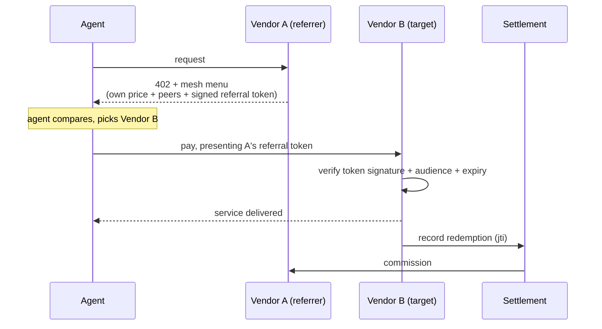
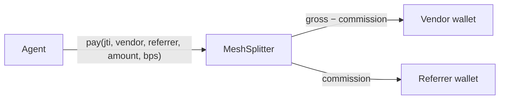

# x402-mesh

**An open peer-pricelist and referral protocol for AI-agent commerce, layered on top of [x402](https://github.com/coinbase/x402).**

When an AI agent hits a paywall, it sees one price and one vendor. x402-mesh turns that dead end into a market: the `402` response also carries a signed menu of competing offers, and if the agent picks a competitor, that competitor pays the referrer a commission. Every vendor is both a seller and a broker. Reciprocity does the rest.

- **Spec:** [SPEC.md](./SPEC.md)
- **Reference middleware:** npm [`x402-mesh`](https://www.npmjs.com/package/x402-mesh)
- **License:** MIT

---

## The problem

x402 gave agents a way to pay over HTTP: a server returns `402 Payment Required` with payment instructions, the agent signs a USDC transfer, and retries. It works. But it is a closed door. The agent sees the vendor's price and nothing else. It cannot compare, and the vendor has no reason to point it anywhere better.

So agents overpay, vendors compete only on being first, and there is no shared layer where the market is visible at the moment that matters: the moment of payment.

## What x402-mesh adds

Two things, both backward compatible. A vanilla x402 client ignores them and pays exactly as before.

1. **A peer menu.** A `402` response carries, alongside the vendor's own price, a short list of competing offers in the same category. Each peer entry can include a price, quality stats, and a signed referral token.
2. **Settlement.** If the agent follows a referral and pays the peer, the peer verifies the token and pays the referrer a commission through a shared settlement endpoint. Default 5%, negotiable per token.



The hidden payoff: every redemption is logged across every participating vendor. The mesh accumulates cross-vendor agent behavior that no single closed payment network can see, which is the foundation for an open agent-reputation primitive.

## Quickstart

Drop the middleware into a Next.js route. You become a participating vendor in about twenty minutes.

```ts
import { withMesh } from 'x402-mesh/next';

export const POST = withMesh({
  category: 'email-validation',
  self: {
    vendor_id: 'your-slug',
    name: 'Your API',
    price: { amount_cents: 3, currency: 'USD', unit: 'per_call' },
    quality: { accuracy: 0.95, p95_latency_ms: 250 },
  },
  alternatives: 'auto', // fetch peers from the registry, or pin a static list
  handler: async (req) => {
    // runs only after payment is verified
    return Response.json({ ok: true });
  },
});
```

Then publish a discovery manifest at `/.well-known/x402-mesh.json` and register your public key once. That is the whole onboarding. See [SPEC.md](./SPEC.md).

## Atomic settlement on Base

Commissions settle in USDC on Base. The reference path is a tiny non-custodial splitter contract ([`contracts/MeshSplitter.sol`](./contracts/MeshSplitter.sol)): the agent pays the contract, and it forwards the vendor share and the referrer commission in a single transaction. No escrow, no platform float, no trust.



A crypto-native vendor onboards with a single field: a Base wallet address. No Stripe account, no KYC. Fiat rails (Stripe Connect, manual invoice) exist as opt-in fallbacks for vendors who will not take USDC.

## Identity: composed, not reinvented

x402-mesh is the **commerce** layer. It deliberately does not define how an agent proves who it is. That is a separate, fast-moving problem being solved by people with the right mandate, and the protocol is built to compose with whichever standard wins:

- **[Catena ACK-ID](https://catenalabs.com/)** — agent identity via W3C DIDs and Verifiable Credentials.
- **IETF WIMSE** and **OAuth 2.0 Token Exchange (RFC 8693)** — the same short-lived, audience-scoped, single-hop token model Uber describes in [its agent-identity architecture](https://www.uber.com/us/en/blog/solving-the-agent-identity-crisis), including an actor-chain claim that records full delegation lineage.
- **[A2A](https://github.com/google/A2A)** — agent-to-agent interop.

The mesh token already uses the same primitives these standards rely on: an ed25519 JWT with issuer, audience, expiry, and a single-use id. A referral can optionally carry an actor-chain claim so a referred payment proves provenance (which agent, acting for whom). Bring your own identity layer; the mesh settles the money.

## What this is not

- Not a marketplace. No central UI, no listings, no reviews. It is a wire format and a settlement primitive.
- Not price-fixing. Vendors set their own prices; the protocol only makes them visible at the moment of agent payment.
- Not a closed network. There is no gatekeeper, no paid certification, no "verified partner" badge. Anyone can run a registry; identity is your public key.

## Repository layout

```
README.md              this file
SPEC.md                the v0.1 wire spec
contracts/             MeshSplitter.sol + deploy notes
  MeshSplitter.sol
```

The reference middleware, JWT helpers, and payout router are published as the npm package [`x402-mesh`](https://www.npmjs.com/package/x402-mesh).

## License

MIT. Copy it, fork it, run your own registry. The protocol wins when it spreads.
